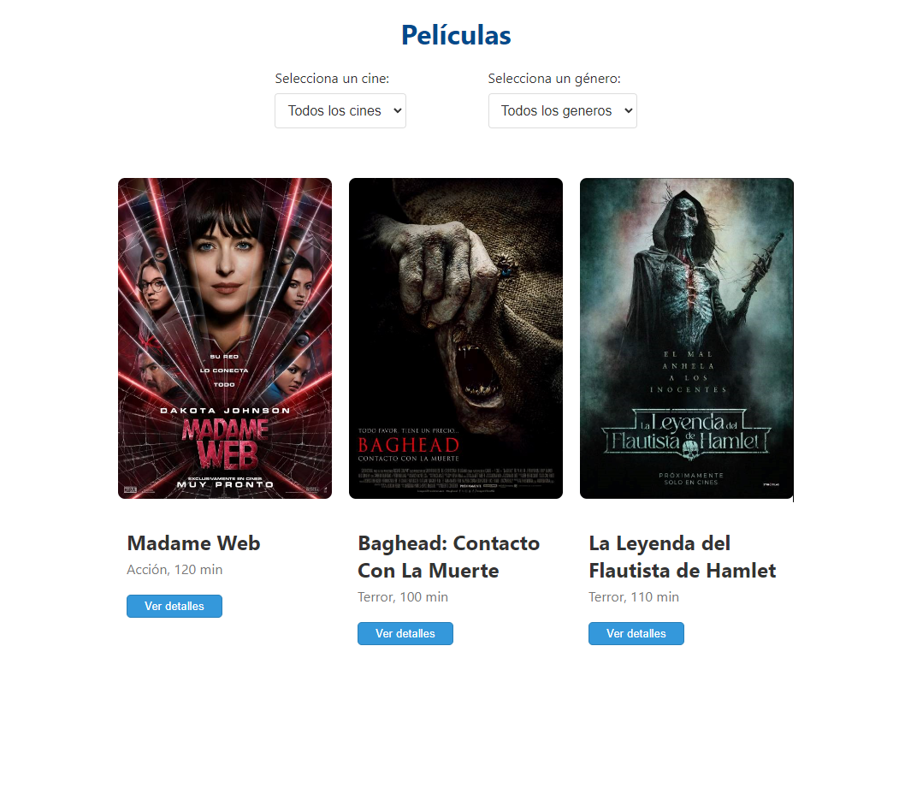
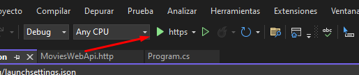
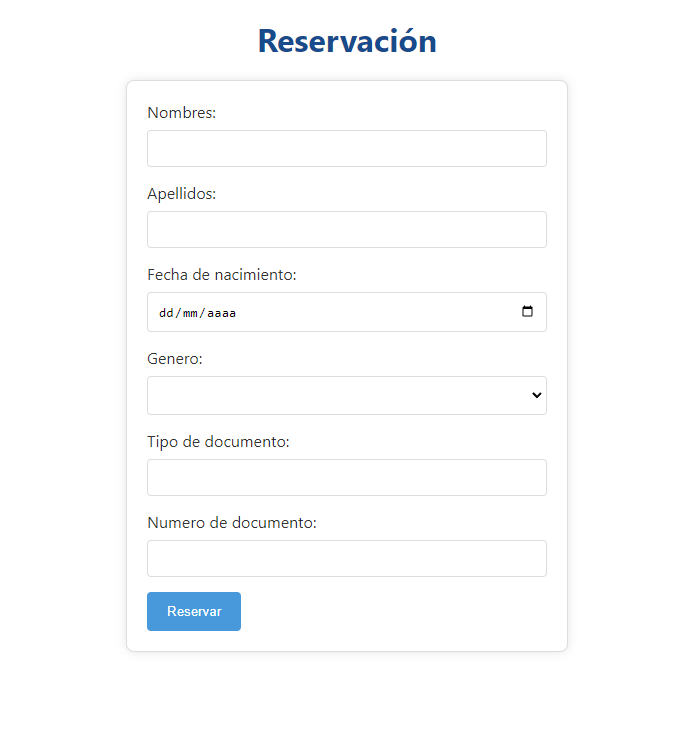
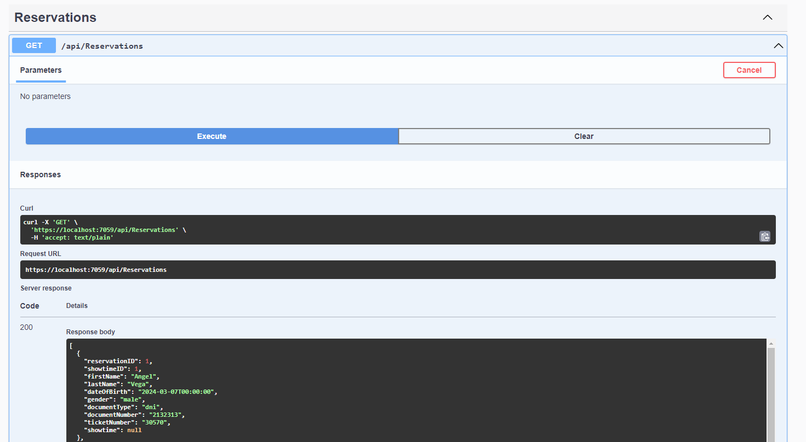

# Movies App (.NET 8  &  ANGULAR 17)

Aplicación web que permita ver la cartelera de películas disponibles en las salas
de cine.




## Tabla de Contenidos

1. [Instalación](#Instalación)
2. [Uso](#Uso)
3. [Ejemplos de Prueba](#ejemplos-de-prueba)

## Instalación
```bash
npm install
```

### En el backend configurar la cadena de conexión y aplicar una migración
```bash
migrations add InitialMigration
```

### Luego actualizar base de datos
```bash
database update
```
## Uso

### Front End
```bash
ng serve
```
### Back End
```bash
Ejecutar proyecto
```



## Ejemplos de prueba


#### 1. Insertar una película
```bash
{
  "title": "string",
  "genre": "string",
  "synopsis": "string",
  "duration": 0,
  "startTime": "2024-03-04T04:13:42.245Z",
  "imageURL": "string"
}
```

#### 2. Insertar una función
```bash
{
  "movieID": 0,
  "theater": "string",
  "startTime": "2024-03-04T04:15:12.910Z",
  "endTime": "2024-03-04T04:15:12.910Z",
  "availableSeats": 0,
}
```
#### 3. Reservar una función de la película seleccionada




#### 4. Verificar en el Swagger que se reservó correctamente


